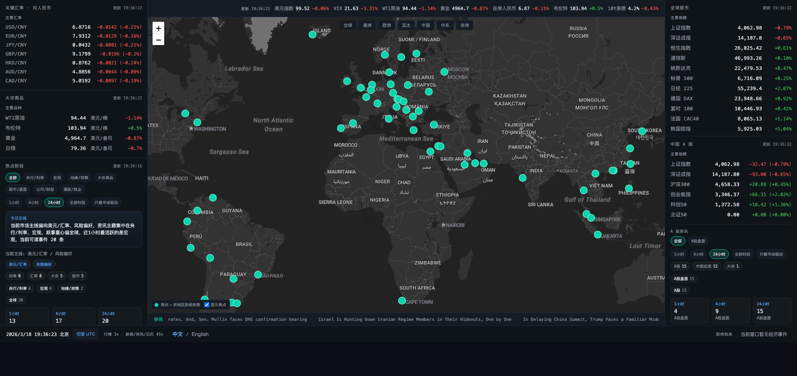
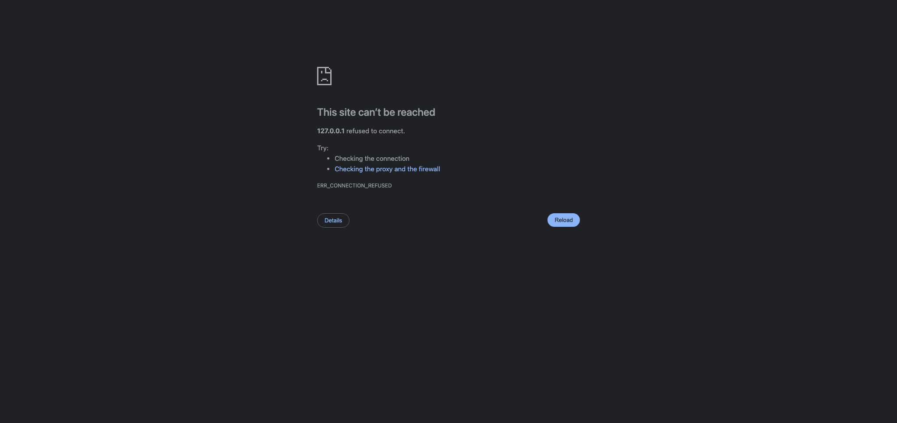

# 全球金融财经作战图

**Repository:** [https://github.com/channb1026/world-finacne](https://github.com/channb1026/world-finacne)

一个面向宏观、跨市场和区域情报观察的单屏 monitor。界面以“作战室”方式组织信息：

- 左侧看关键汇率、大宗商品和热点财经
- 中央看关键指标、全球地图和地区情报
- 右侧看全球股市与中国 A 股
- 底部看时间、快讯和真实经济日历

当前版本不依赖 mock 数据，核心面板全部走后端真实接口，并以多源聚合、fallback、低干扰阅读和稳定轮询为核心设计目标。

| 中文界面 | 英文界面 |
|----------|----------|
|  |  |

## 项目定位

这个项目不是通用门户首页，而是一个偏 monitor 的信息面板，目标是在一屏内快速回答这些问题：

- 全球主要风险资产和避险资产现在怎么走
- 哪些宏观、政策和地缘事件正在影响市场
- 哪个国家或地区正在出现新的政经热点
- 中国 A 股当前的盘面和资讯重点是什么
- 未来几天有哪些值得盯的真实经济事件

因此实现上优先追求：

- 真数据，而不是占位内容
- 多源聚合，而不是单一来源
- 阅读效率，而不是堆砌内容
- 低干扰主界面，同时保留内部可观测性

## 核心能力

- 中英文双语界面，支持 `?locale=zh` / `?locale=en`
- 地图区域预设与 URL 视角同步
- 页面隐藏时自动暂停轮询
- 市场轮询优先走聚合接口，降低高频刷新请求量
- 行情、新闻、快讯、地图和经济日历全部走真实数据
- 资讯层具备事件聚合、去重、分类、主线提炼和时间回看能力
- 支持按分类、时间窗口和“只看市场驱动”筛选资讯
- 前端具备运行时错误兜底，避免异常直接白屏
- 后端具备缓存、fallback、超时保护、基础限流、优雅关闭和部分降级返回能力

## 数据源策略

项目的数据源策略尽量保持稳定而不过度绑定单一站点，整体分为三层：

- 直接源
  - 直接使用公开 RSS、官方 feed 或稳定可访问接口
- 定向聚合源
  - 通过 Google News 站点定向搜索等方式补足覆盖面
- fallback / 备用源
  - 在主源异常时提供基础连续性

当前主要数据面向如下：

- 行情与指标
  - 主源：Yahoo Finance
  - 汇率备用：Frankfurter
- 经济日历
  - 主源：Trading Economics
  - 备用：EODHD Economic Events
- 新闻与地区情报
  - 国际源与中文源混合接入
  - 输出时按权威性、时效性、盘面贴近度和信息密度做分层排序

README 中提到某个媒体时，默认表示“内容已进入系统可用来源池”，不一定意味着该站采用官方 RSS/API 直连。

## 运行方式

### 环境要求

- Node 22+

仓库根目录已提供 `.nvmrc`。如果使用 `nvm`，可以在根目录执行：

```bash
nvm use
```

### 前端

```bash
cd frontend
npm install
npm run dev
```

默认地址通常是：

- [http://localhost:5173/](http://localhost:5173/)

### 后端

```bash
cd backend
npm install
npm run dev
```

默认地址通常是：

- [http://localhost:3000/](http://localhost:3000/)

开发模式下，前端通过 Vite 代理将 `/api` 转发到后端，所以应先启动后端，再打开前端页面。

### 一键启停

根目录提供：

- `./start.sh`
- `./stop.sh`

用于后台启动和停止前后端服务。

## 常用环境变量

### 安全

- `ALLOWED_ORIGINS`
- `RATE_LIMIT_MAX`
- `RATE_LIMIT_WINDOW_MS`

### 经济日历

- `TRADING_ECONOMICS_API_KEY`
- `EODHD_API_TOKEN`

### 调试

- `VITE_SHOW_SOURCE_HEALTH=true`
  - 显示前端内部源状态面板

## 项目结构

```text
world_finance/
├── frontend/
│   └── src/
│       ├── components/
│       ├── views/
│       ├── services/
│       ├── state/
│       ├── stores/
│       ├── i18n/
│       ├── types/
│       ├── utils/
│       └── data/
├── backend/
│   └── src/
│       ├── routes/
│       ├── services/
│       ├── data/
│       ├── security.js
│       ├── sourceStatus.js
│       └── index.js
├── screenshot.png
├── screenshot-en.png
├── start.sh
├── stop.sh
└── README.md
```

## 已知边界

- 部分 RSS 源可能因为 403、超时、TLS 或地区网络差异而暂时不可达
- 海外环境下，部分中文财经源的稳定性通常弱于国际源
- A 股资讯虽然已经多源接入，但仍会受到上游可达性影响
- 经济日历默认凭证适合开发体验，不适合作为生产级 SLA 保证
- Yahoo Finance 仍然是主行情源，当前虽已加超时与退避，但上游长期不可用时覆盖面仍会下降
- 内部源状态监控默认隐藏，不会直接展示给终端用户

## 测试与验证

常用检查命令：

```bash
cd frontend && npm run lint
cd frontend && npm test
cd frontend && npm run build
cd backend && npm test
```
